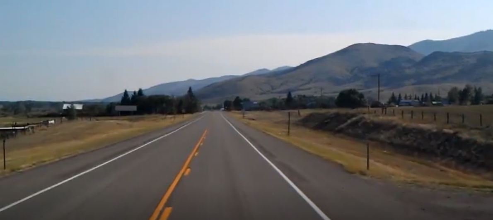
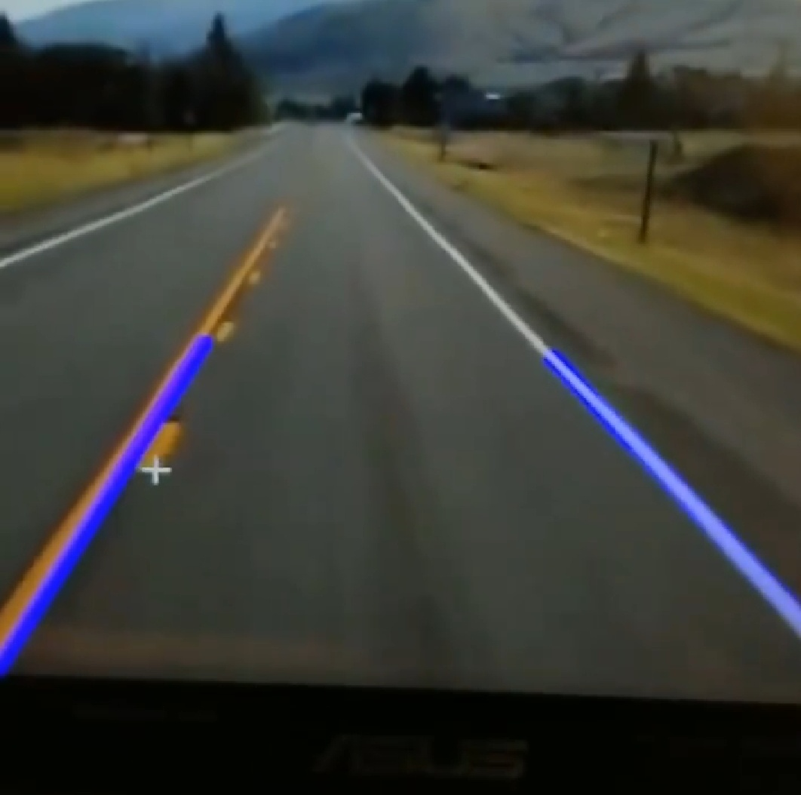

# Learn OpenCV


## Before


## After


### Dependencies

#### Core
```
pip install cv2     # computer vision library
pip install numpy   # support for large, multi-dimensional arrays
```

#### Additional
```
pip install pyserial    # communication with arduino
pip install matplotlib  # to get numerical value for coordinates
pip install cvlib       # for object detection
pip install tensorflow  # required for cvlib
```

<!-- diagram of how the auto rc will work  -->

# Units
* input unit        (part of this repo - tcp server to get live footage)
(rceyes.py?)
* processing unit   (what repo will focus on)
(rccortex.py)
* rc control unit   (part of this repo - pyserial to send signals to arduino)
(rcbellum.py)

# Other
* use ezgif.com/resize-video to resize videos: 1000 x 720
* use ezgif.com/crop-video to crop videos: 1000 x 720
### Sources
https://www.youtube.com/watch?v=kft1AJ9WVDk
